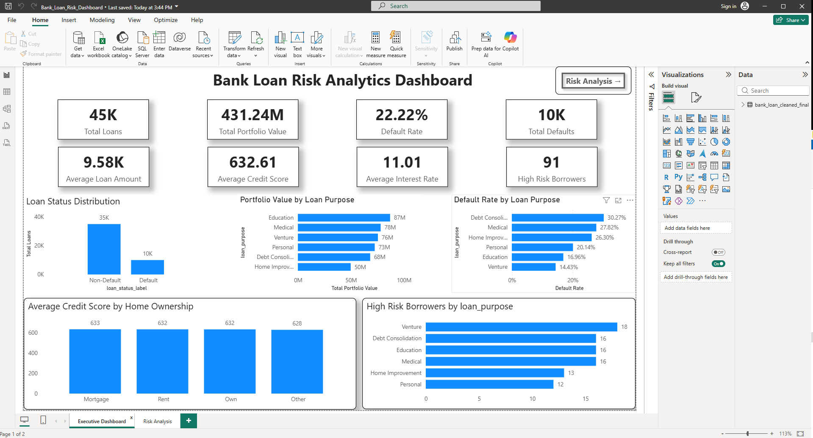
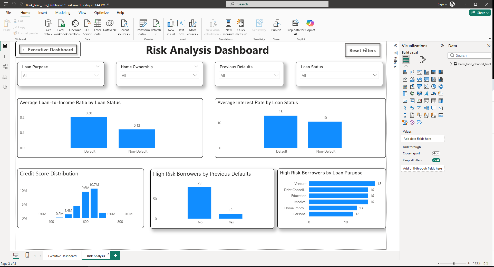

# 🏦 End-to-End Bank Loan Risk Analytics Dashboard

<p align="center">


</p>

---

# 📌 Project Overview

This project is a complete **Bank Loan Risk Analytics Solution** built using **Python, SQL, and Power BI**.

The objective is to analyze customer loan data, identify high-risk borrowers, evaluate loan defaults, and build an interactive business intelligence dashboard that supports better lending decisions.

The project follows a complete analytics workflow from raw data to executive reporting.

---

# 🎯 Business Problem

Financial institutions process thousands of loan applications every year.

One of the biggest challenges is identifying borrowers who are likely to default before approving loans.

This project answers questions such as:

- Which loan purposes have the highest default rates?
- Which customers are considered high risk?
- How do credit score and previous defaults impact loan repayment?
- Which borrower segments deserve additional attention?

---

# 🛠 Tech Stack

| Tool | Purpose |
|-------|----------|
| Python | Data Cleaning & Preparation |
| Pandas | Data Transformation |
| MySQL | Business Analysis |
| Power BI | Dashboard & Visualization |
| GitHub | Portfolio Hosting |

---

# 📂 Project Workflow

```
Raw Dataset
      │
      ▼
Python Data Cleaning
      │
      ▼
Clean Dataset
      │
      ▼
SQL Business Analysis
      │
      ▼
Power BI Dashboard
      │
      ▼
Business Insights
```

---

# 📁 Repository Structure

```
bank-loan-risk-analytics/

│
├── 01_Raw_Data
│      └── loan_data.csv
│
├── 02_Clean_Data
│      ├── bank_loan_prepared.csv
│      └── bank_loan_cleaned_final.csv
│
├── 03_Python
│      └── 01_Data_Cleaning.ipynb
│
├── 04_SQL
│      └── bank_loan_business_analysis.sql
│
├── 05_PowerBI
│      └── Bank_Loan_Risk_Dashboard.pbix
│
├── 06_Dashboard_Screenshots
│      ├── executive_dashboard.png
│      └── risk_analysis_dashboard.png
│
└── README.md
```

---

# 🐍 Python Data Cleaning

The following data preparation steps were performed:

✔ Missing Value Treatment

✔ Duplicate Detection

✔ Data Validation

✔ Feature Engineering

✔ Data Type Conversion

✔ Clean Dataset Export

---

# 🗄 SQL Analysis

More than **25 SQL business queries** were written to answer critical business questions.

Some examples include:

- Total Loans Issued
- Portfolio Value
- Loan Default Rate
- High Risk Borrowers
- Credit Score Analysis
- Interest Rate Analysis
- Previous Defaults Analysis
- Loan Purpose Analysis
- Home Ownership Analysis

---

# 📊 Executive Dashboard

This dashboard provides a high-level overview of the bank's lending portfolio.

### KPIs

- Total Loans
- Total Portfolio Value
- Default Rate
- Total Defaults
- Average Loan Amount
- Average Credit Score
- Average Interest Rate
- High Risk Borrowers

### Visuals

- Loan Status Distribution
- Portfolio Value by Loan Purpose
- Default Rate by Loan Purpose
- Average Credit Score by Home Ownership
- High Risk Borrowers by Loan Purpose

---

<p align="center">

## Executive Dashboard



---

## 🔍 Risk Analysis Dashboard



</p>

---

# 🔍 Risk Analysis Dashboard

This page enables deeper investigation of customer risk.

### Interactive Filters

- Loan Purpose
- Home Ownership
- Previous Defaults
- Loan Status

### Visuals

- Average Loan-to-Income Ratio
- Average Interest Rate
- Credit Score Distribution
- High Risk Borrowers by Previous Defaults
- High Risk Borrowers by Loan Purpose

---

<p align="center">

# 📈 Key Business Insights

### 📌 Previous Defaults significantly increase future default probability.

### 📌 Customers with lower credit scores contribute to higher portfolio risk.

### 📌 Certain loan purposes consistently show higher default rates.

### 📌 Higher Loan-to-Income Ratio is associated with increased borrower risk.

### 📌 Interest Rate varies noticeably between defaulted and non-defaulted borrowers.

---

# 💼 Skills Demonstrated

- Data Cleaning
- Data Wrangling
- Exploratory Data Analysis
- SQL Query Writing
- Business Intelligence
- Dashboard Development
- KPI Design
- Data Storytelling
- Git & GitHub

---

# 🚀 Future Improvements

- Machine Learning Loan Default Prediction
- Customer Risk Scoring Model
- Loan Approval Recommendation Engine
- Time-Series Portfolio Monitoring
- Automated Data Refresh

---

# 👨‍💻 About Me

**Deepak Yadav**

Aspiring Data Analyst passionate about transforming raw data into meaningful business insights.

### Skills

- Excel
- SQL
- Python
- Power BI

Currently building real-world analytics projects to strengthen my Data Analytics portfolio.

---

# ⭐ If you found this project useful, consider giving it a Star!
